# Azure Synapse Lakehouse | AdventureWorks Sales Analytics

## 🎯 Descripción
📄Proyecto de Data Engineering desarrollado en Azure Synapse Analytics que implementa una arquitectura Lakehouse basada en el patrón Medallion (Bronze, Silver y Gold). La solución procesa información de clientes, productos y ventas del dataset AdventureWorks utilizando PySpark, Azure Data Lake Storage Gen2 y Synapse Pipelines para construir datasets analíticos listos para consumo por herramientas de Business Intelligence como Power BI.

El flujo contempla la ingesta de datos hacia la capa Bronze, la transformación y modelado dimensional en Silver, y la generación de métricas y agregaciones de negocio en Gold. Cada capa se encuentra desacoplada para facilitar la gobernanza, trazabilidad, escalabilidad y reutilización de los datos.

La solución incorpora automatización mediante Synapse Pipelines, almacenamiento de datos en formato Parquet y modelado analítico basado en dimensiones y hechos, siguiendo buenas prácticas utilizadas en entornos empresariales modernos de Data Engineering.

---

## 🏛️ Arquitectura

### ➡️ Flujo de Datos

```
📄 AdventureWorks Source Files
    ↓
🥉 Bronze Layer (Raw Ingestion)
    ↓
🥈 Silver Layer (Data Cleansing & Dimensional Modeling)
    ↓
🥇 Gold Layer (Business Aggregations & KPIs)
```

### ✨ Características Principales

- 🏗️ **Arquitectura Medallion** - Implementación de capas Bronze → Silver → Gold
- ⚡ **Procesamiento Distribuido** - Transformaciones desarrolladas con PySpark sobre Synapse Spark Pools
- 📂 **Data Lake Storage Gen2** - Persistencia de datos en formato Parquet
- 🔄 **Orquestación con Synapse Pipelines** - Ejecución automatizada de notebooks y flujos ETL
- 📊 **Modelo Dimensional** - Construcción de dimensiones y tabla de hechos para análisis
- 📈 **Analytics Ready** - Datasets preparados para consumo por Power BI
- 🚀 **Lakehouse Architecture** - Separación entre almacenamiento, procesamiento y consumo
- 🔍 **Trazabilidad de Datos** - Flujo controlado desde la capa raw hasta la capa analítica

---

## 📦 Capas del Pipeline

<table>
<tr>
<td width="33%" valign="top">


#### 🥉 Bronze Layer
**Propósito**: Ingesta de datos crudos

**Tablas**:
- Customer
- Address
- CustomerAddress
- Product
- ProductCategory
- ProductModel
- SalesOrderHeader
- SalesOrderDetail

**Características**:
- ✅ Datos sin transformaciones
- ✅ Conservación de estructura original
- ✅ Persistencia en tablas Spark
- ✅ Base para procesamiento posterior
- ✅ Trazabilidad de la fuente original

</td>
<td width="33%" valign="top">

#### 🥈 Silver Layer
**Propósito**: Limpieza e integración

**Tablas**:
- dim_customer
- dim_product
- fact_sales

**Características**:
- ✅ Integración de múltiples fuentes
- ✅ Construcción de dimensiones de negocio
- ✅ Creación de tabla de hechos de ventas
- ✅ Normalización y estandarización
- ✅ Preparación para análisis dimensional
- ✅ Persistencia en tablas y archivos Parquet

</td>
<td width="33%" valign="top">

#### 🥇 Gold Layer
**Propósito**: Consumo analítico

**Tablas**:
- sales_by_month
- sales_by_category
- top_products
- sales_kpis

**Características**:
- ✅ Agregaciones de negocio
- ✅ KPIs comerciales
- ✅ Ventas por categoría
- ✅ Ventas por periodo
- ✅ Ranking de productos
- ✅ Optimizado para Power BI
- ✅ Persistencia en tablas y archivos Parquet

</td>
</tr>
</table>

---

## 🔄 Orquestación


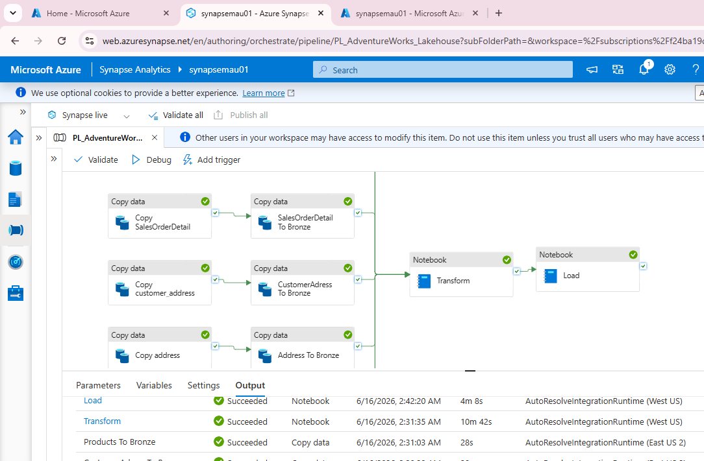


---

## 📁 Estructura del Proyecto

```
PL_AdventureWorks_Lakehouse/
│
├── 📂 Notebooks/
│   ├── 01_Raw_To_Bronze.ipynb  
│   ├── 02_Bronze_To_Silver.ipynb
│   └── 03_Silver_To_Gold.ipynb
│
├── 📂 Pipeline/
│   └── PL_AdventureWorks_Lakehouse_support_live.zip
│
└── 📄 README.md
```

---

## ⚙️ Requisitos Previos

- ☁️ Cuenta de Azure con acceso a Synapse
- 🖥️ Cluster activo Apache Spark pool
- 🐙 Cuenta de GitHub con permisos de administrador
- 📦 Azure Data Lake Storage Gen2 configurado
- 📊 Power BI Desktop (opcional para visualización)

---

## 🛠️ Tecnologías Utilizadas

```
Azure Synapse Analytics
Azure Data Lake Storage Gen2
Apache Spark (PySpark)
Synapse Pipelines
Parquet
SQL
GitHub
Power BI
```

---

## 🚀 Instalación y Configuración

### 1️⃣. Creación del Synapse Workspace
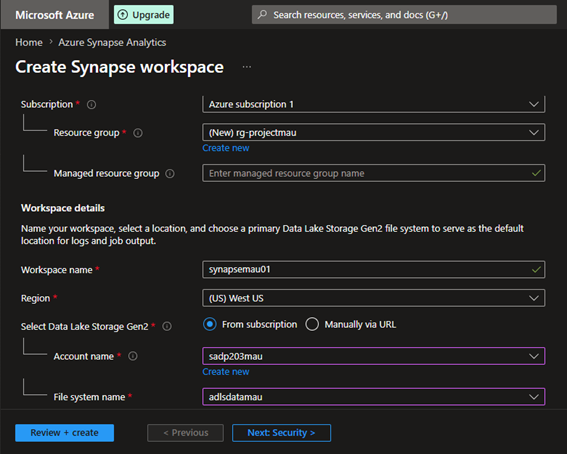

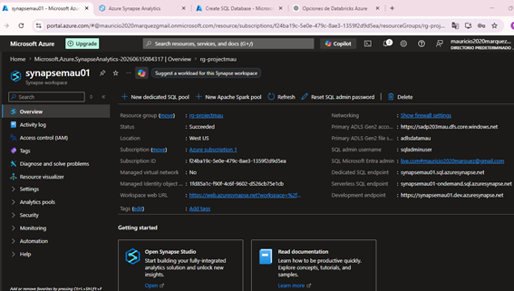


### 2️⃣. En Synapse configuramos el data que usaremos: adlsdatamau

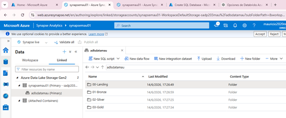


### 3️⃣. Creo el database en Azure SQL y habilito "AdventureWorks"

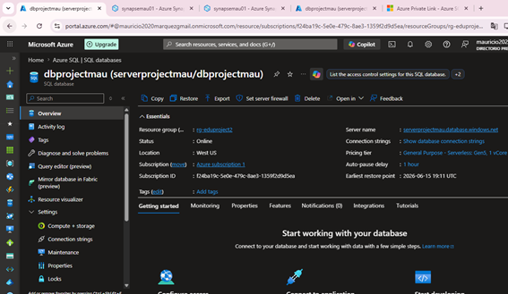

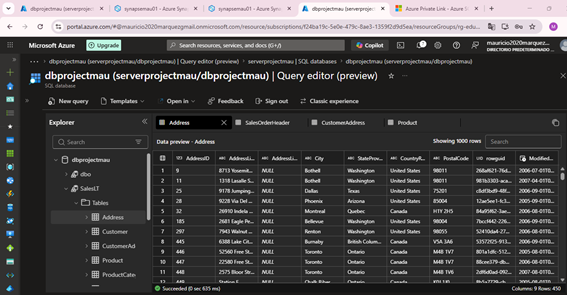


### 4️⃣. En Synapse creamos los linked Service para Azure SQL y Azure Data Lake Storage Gen 2

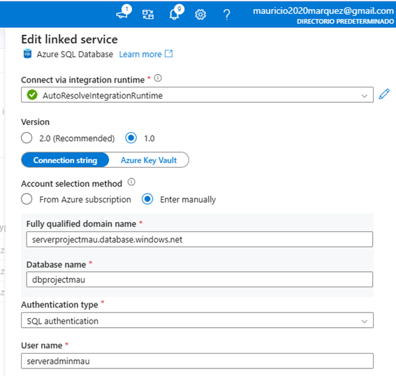

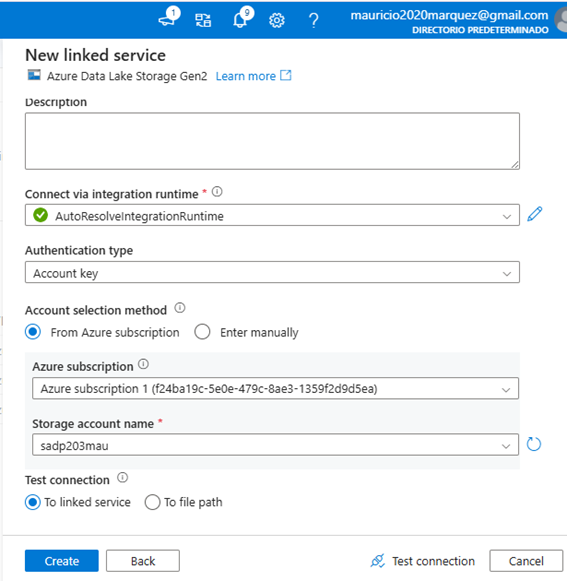


### 5️⃣. En Integrate Pipeline configuramos los bloques de copy data

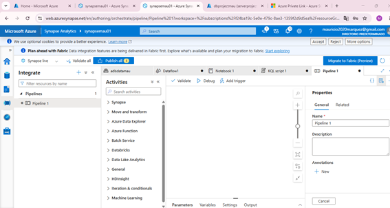

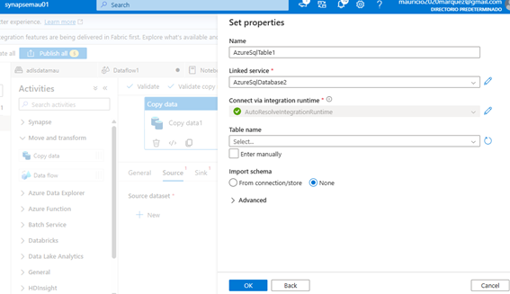


### 6️⃣. Con "copy data" copiamos la tabla da Azure SQL a Azure Data Lake Storage Gen 2 (container Landing)

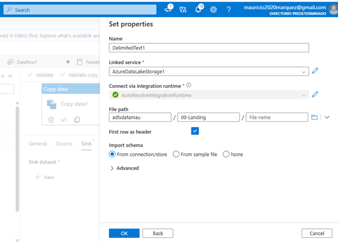

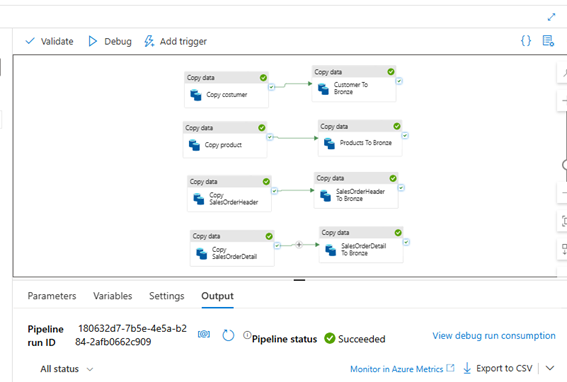

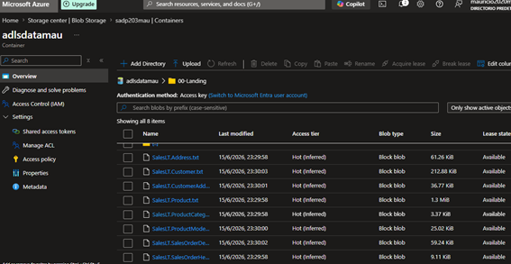

### 7️⃣. Configuramos Apache Spark Pool

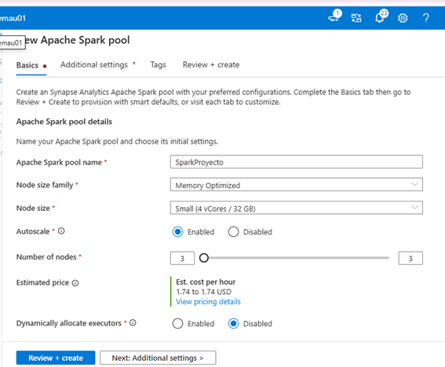


### 8️⃣. 01_Raw_To_Bronze.ipynb: Cargamos la data hacia el db Bronze y a la carpeta Bronze

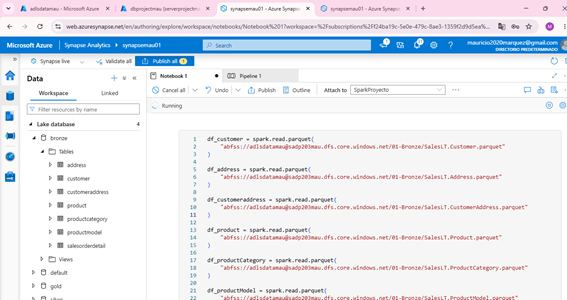

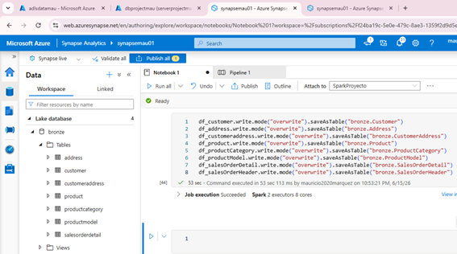

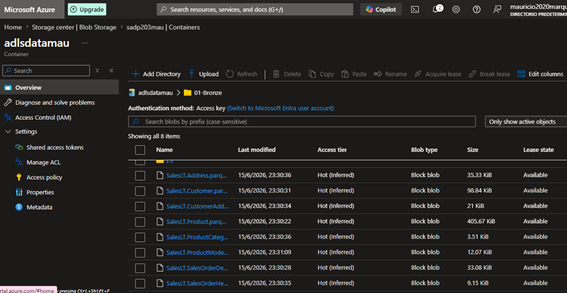

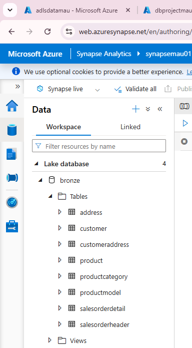


### 9️⃣. La metadata de Bronze estara en "adlsdatamau -> synapse -> workspace"

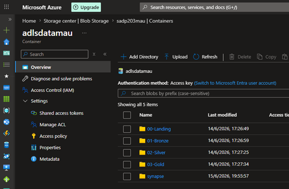

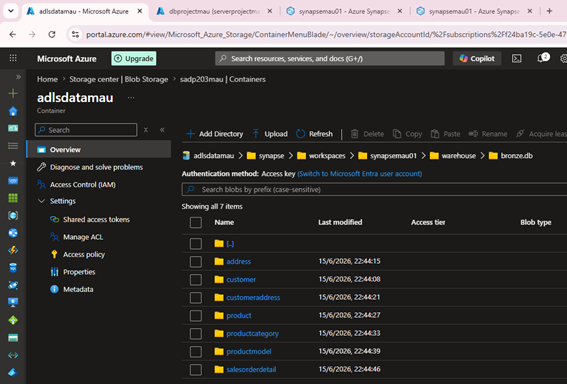


### 1️⃣0️⃣. Configuramos el bloque Transform con "02_Bronze_To_Silver.ipynb"

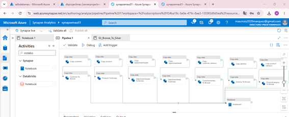


### 1️⃣1️⃣. "02_Bronze_To_Silver.ipynb" se usa para la transformación y carga a la carpeta Silver y db Silver

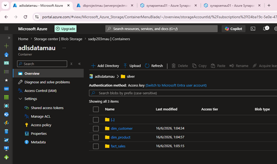


### 1️⃣2️⃣. Configuramos el bloque Load con "03_Silver_To_Gold.ipynb"

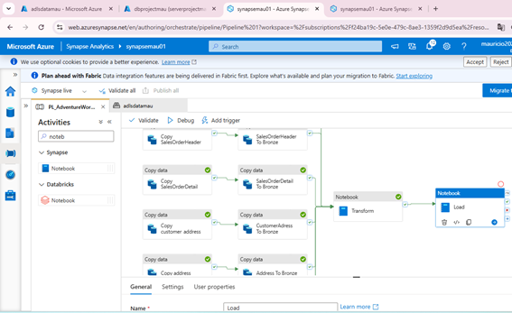


### 1️⃣3️⃣. "03_Silver_To_Gold.ipynb" se usa para la carga a la carpeta Gold y db Gold

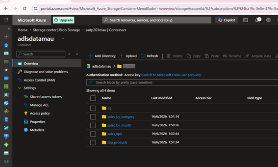

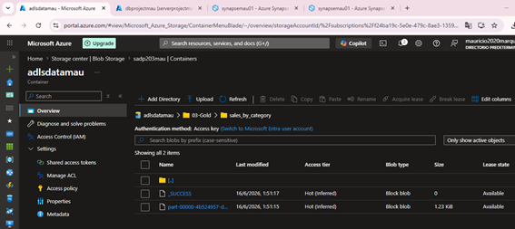


### 1️⃣3️⃣. Consulto la data de mi db Bronze


